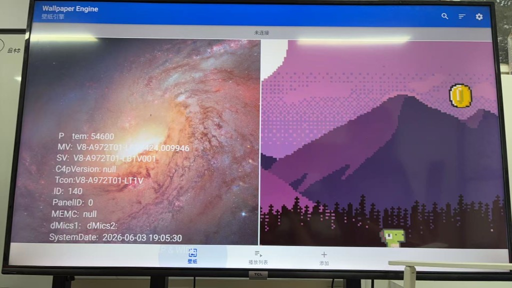

# tcl-tv-wallpaper-engine

TCL Android 9 电视上的 Wallpaper Engine 2.7.4 部署工具链。

目标平台：TCL 55A30-7CD6（A972T01），API 28，armeabi-v7a，1920×1080，固件 `V8-A972T01-LF1V424`。

## 实现

**TCL renew 安装通道** — `install-tv-apk-renew.ps1` 通过 `com.tcl.packageinstaller.service.renew/.PackageInstallerService` 安装 APK，绕过 `install_switch_flag: 0` 对 `adb install` 的拦截。安装结果从 logcat `InstallAppProgressAPI28` 的 `returnCode` 读取。

**APKM 单包重建** — `build-we-274-v7a.ps1` 用 apktool 解包 2.7.4 base，清除 `requiredSplitTypes` / `com.android.vending.splits*`，写入 v7a split 里的 `libscenejni.so`，重打包签名。输出 `wallpaper-engine-2.7.4-v7a.apk`（versionCode 4240）。

**APKM 下载** — `fetch-we-274.ps1`，CDN 直链，断点续传。

**统一部署** — `setup-tcl-wallpaper.ps1` / `install-we-tv.ps1`：adb 推包、renew 安装、可选 mpkg 推送。

**桥接 APK** — `tcl-wallpaper/`（`com.tclsystemfinder.wallpaper`）：Leanback UI，扫描存储中的 `.mpkg`，复制到 `/sdcard/Download/`，拉起 WE import intent。

**adb 封装** — `adb-tv.ps1`，按 `tcl-tv-spec.json` 区分 emu / tv 目标。

**模拟器 AVD** — `setup-android-tv.ps1`、`recreate-tcl-avd.ps1`、`start-emulator-tcl.ps1`，API 28 Android TV x86，用于桥接和 mpkg 拷贝流程。

**设备常量** — `scripts/tcl-tv-spec.json`：adb 地址、包名、WE versionCode、renew service 组件名。

## 目录

```
scripts/
  install-tv-apk-renew.ps1
  build-we-274-v7a.ps1
  fetch-we-274.ps1
  merge-we-apkm-v7a.py
  install-we-tv.ps1
  setup-tcl-wallpaper.ps1
  adb-tv.ps1
  tcl-tv-spec.json
tcl-wallpaper/
firmware/apk/          # 本地 APKM / 产物目录（gitignore）
```

## 测试记录

| 项 | 结果 |
|----|------|
| renew 安装 WE 4240 | `returnCode == 0` |
| `BrowseActivity` 启动 | 正常，无 `libscenejni.so` 缺失 |
| 桥接 APK renew 安装 | 正常 |
| WE 2.8.x (4354) on API 28 | native `unknown reloc type 17` |
| zip 合并 APKM（未清 manifest） | renew 安装 status 4 |

WE 安装包与 `.mpkg` 不进仓库。

## License

MIT

## 真机截图

TCL 55A30-7CD6，`V8-A972T01-LF1V424`，WE 2.7.4 BrowseActivity。


